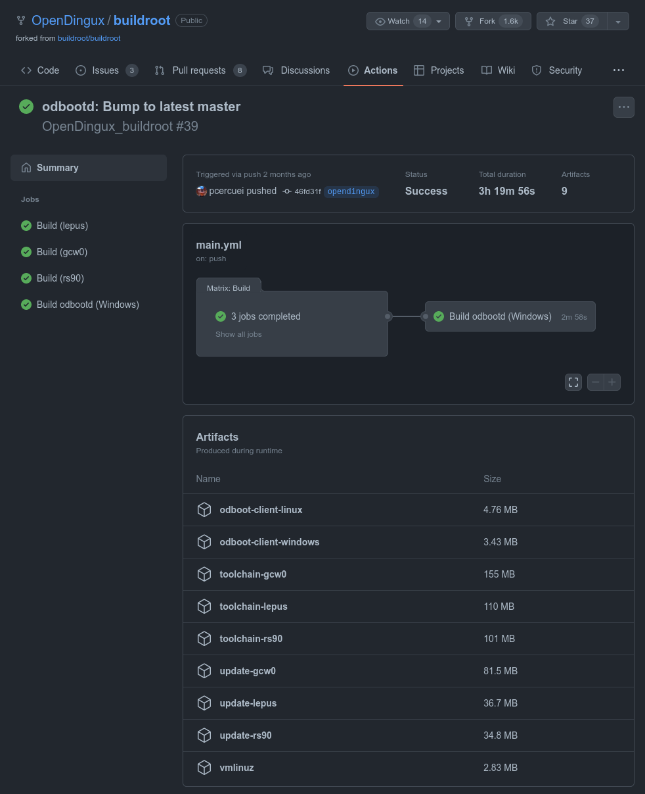

# Adam image

Adam image is a software compilation for the internal microSD card slot of a series of Ingenic JZ4770 chip-based portable emulation consoles. Specifically GCW-Zero, PocketGo2 v1/v2, Anbernic RG350, RG280 and RG300X.

If you only want to use one of the images published in [releases](https://github.com/eduardofilo/RG350_adam_image/releases), see the documentation on the [wiki](https://github.com/eduardofilo/RG350_adam_image/wiki).

## Build

If you want to build the image from its sources, the basic procedure is as follows:

1. Download repository with submodules (**IMPORTANT**: don't forget the `--recursive` option):

    ```
    git clone --recursive https://github.com/eduardofilo/RG350_adam_image.git
    cd RG350_adam_image
    ```

2. Modify the parameters provided at the beginning of the building script as appropriate:

    ```
    ## ODbeta params
    ODBETA_DOWNLOAD_PLAN="A"        # "A": Direct download; "B": Artifact from GHAction
    ODBETA_VERSION=2022-02-13       # ODbeta version to install. It should correspond with direct download or GHArtifact
    ### For plan "A"
    ODBETA_DIR_URL=http://od.abstraction.se/opendingux/26145a93f2e17d0df86ae20b7af455ea155e169c
    ### For plan "B"
    ODBETA_ARTIFACT_ID=287825131    # ID of `update-gcw0` artifact in last workflow execution of `opendingux`
                                    # branch in https://github.com/OpenDingux/buildroot repository
    GITHUB_ACCOUNT=PUT_HERE_YOUR_GITHUB_ACCOUNT
    GITHUB_TOKEN=PUT_HERE_A_GITHUB_TOKEN
    ## Other params
    MAKE_PGv1=true                  # Build image for GCW-Zero and PocketGo2 v1
    MAKE_RG=true                    # Build image for RG350 and derived
    COMP=xz                         # gz or xz
    P1_SIZE_SECTOR=819168           # Size of partition 1 in sectors (819168 sectors= ~400M)
    SIZE_M=3200                     # Final image size in MiB
    ```

3. Modify the contents of the `data` directory if you want to make any changes to the contents of partition 2 on the INT card.
4. Build the image:

    ```
    ./build.sh
    ```

5. You will find the image dump ready to flash in the `releases` directory.

## ODbeta OPK update download

The first parameters discussed in item 2 of the list above are related to downloading the ODBeta installation OPK which can be obtained from two places:

* Plan "A": Direct download from [http://od.abstraction.se/opendingux/](http://od.abstraction.se/opendingux/). For this plan we only have to locate the directory where the OPK we are interested in is located and assign its URL to the `ODBETA_DIR_URL` parameter. Within that directory must be the OPK with the date in the name that we have assigned to the `ODBETA_VERSION` parameter.
* Plan "B": Obtained from the artifacts of the actions execution in the Github repository `OpenDingux/buildroot`. There are two alternatives to make the download work well over the Adam image build script. We see them below.

#### Manual download

Manually download the OPK by searching for it in the most recent run of the `OpenDingux_buildroot` workflow from the `OpenDingux/buildroot` repository actions corresponding to the `opendingux` branch. For example at the time of writing this article this is what could be found in the repository:


In this case we would open the execution of the workflow named `odbootd: Bump to latest master` which would take us to the following screen:



Clicking on the artifact named `update-gcw0` will give us the ODbeta update OPK compressed in zip. It only remains to extract the file it contains (named `gcw0-update-2022-04-03.opk` in this case), drop it into the `select_kernel` directory of the image repository and adjust the `ODBETA_VERSION` parameter to match the date contained in the OPK name we just downloaded.

If the OPK corresponding to the `ODBETA_VERSION` parameter is found when running the `build.sh` image compilation script, the script will skip the download process. In this case it will not be necessary to set the `ODBETA_ARTIFACT_ID`, `GITHUB_ACCOUNT` and `GITHUB_TOKEN` parameters.

#### Automated download

In this case, the `build.sh` image build script will attempt to download the ODbeta installation OPK. To do this, it is essential to set the `ODBETA_ARTIFACT_ID`, `ODBETA_VERSION`, `GITHUB_ACCOUNT` and `GITHUB_TOKEN` parameters correctly.

To obtain the token to be indicated in the `GITHUB_TOKEN` parameter, go to the following path once logged into Github: `Settings > Developer settings > Personal access tokens`. There click on `Generate new token` and generate a token with the `workflow` scope (the `repo` scope will be automatically selected).

## Telegram channel for updates

Join this Telegram channel to get update notifications: https://t.me/adam_image
